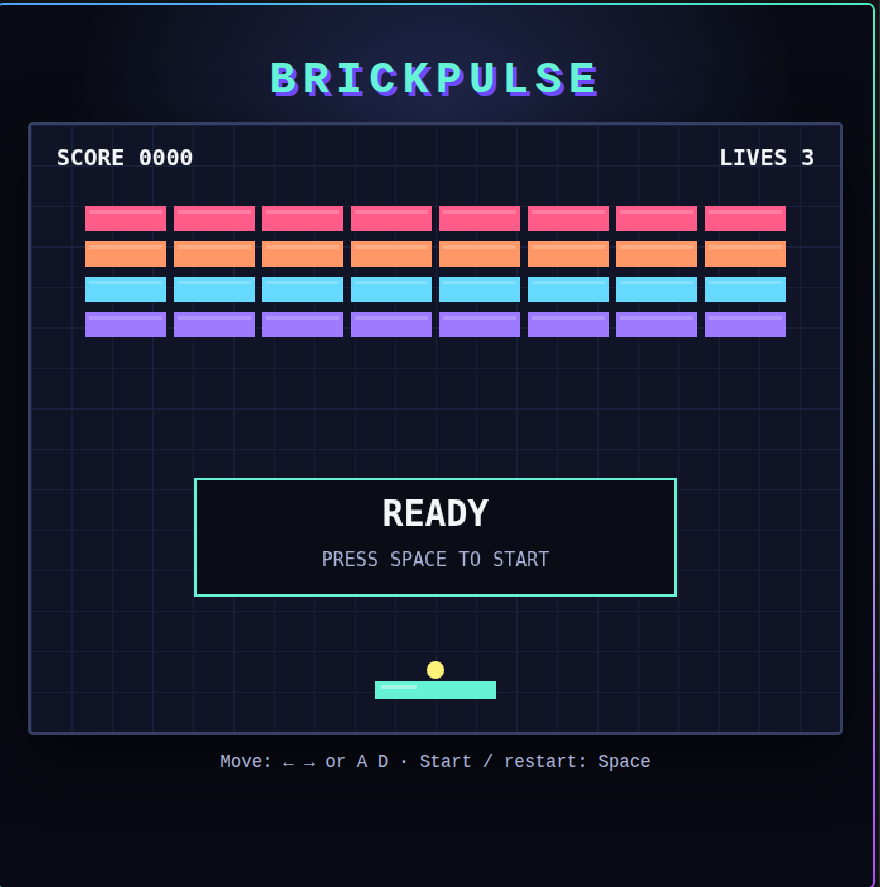
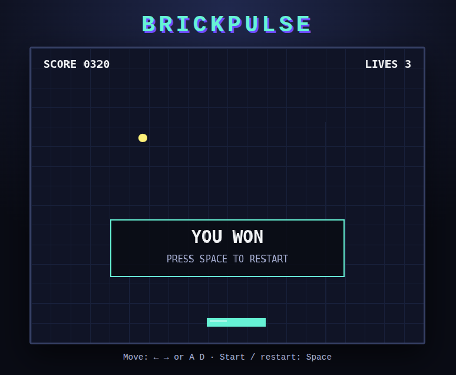
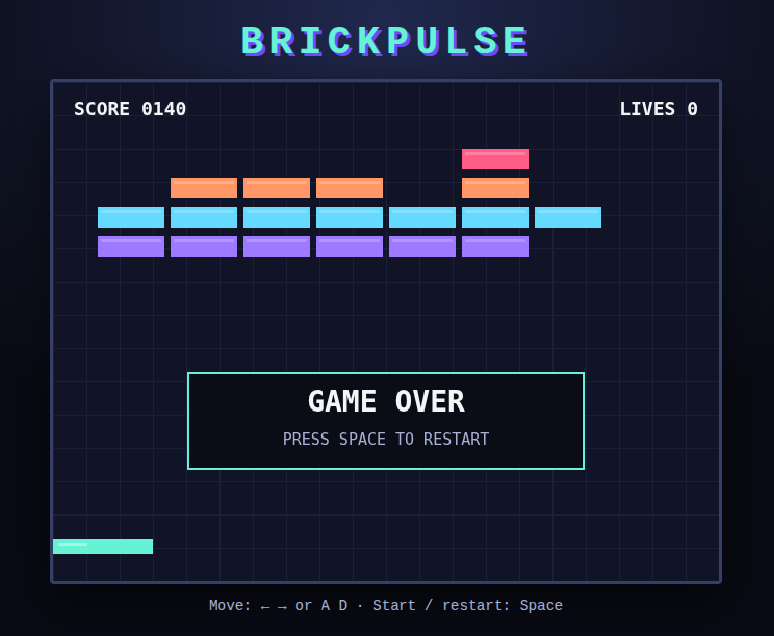

# BrickPulse

BrickPulse is a small Breakout-inspired browser game rendered on one HTML Canvas. The game contains one paddle, one ball, a fixed 4x8 brick grid, one level, a score, and three lives. Its scope and required behavior are defined in `docs/GAME_SPEC.md`.

## Setup and execution

```bash
npm install
npm run dev -- --host 127.0.0.1
```

The development server normally serves the application at `http://127.0.0.1:5173/`. The browser controls are Left Arrow/Right Arrow or `A`/`D`; Space starts a `READY` game and restarts a terminal state.

To verify the production build and serve it locally:

```bash
npm run build
npm run preview
```

## Verification commands

- `npm test` runs Vitest's discovered suite, including evaluator files present in the workspace.
- `npm run typecheck` runs TypeScript checking without emitting files.
- `npm run build` runs TypeScript checking and creates the Vite production build.
- `npm run dev` starts the Vite development server.
- `npm run preview` serves the production build locally.
- `npm audit` reports known dependency vulnerabilities.

The standard baseline verification flow is the focused development suite below, followed by `npm run typecheck` and `npm run build`:

```bash
npm test -- src/config.test.ts src/game.test.ts src/input.test.ts
```

The formal Week 3 evaluations and independent holdout are evaluator-owned artifacts. They are retained separately from the standard baseline flow and are not used to tune the implementation:

```bash
npm test -- evals/week3-formal.test.ts
npm test -- evals/week3-holdout.test.ts
```

## Project documentation

- `docs/GAME_SPEC.md` — frozen product specification, scope, and Definition of Done.
- `docs/BUILD_PROMPT_V1.md` — baseline implementation prompt.
- `docs/CONTEXT_MANIFEST.md` — clean baseline context boundary.
- `docs/EVALS.md` — evaluator-owned formal expectations.
- `docs/EVIDENCE_003.md` — actual development, formal, holdout, audit, and review evidence.
- `docs/BROWSER_SMOKE_TEST.md` — reproducible browser smoke-test steps and observed result.
- `docs/AI_USAGE_LOG.md` — factual record of meaningful AI-assisted work and outcomes.

Implementation, focused tests, and browser code are under `src/`; evaluator-owned tests are under `evals/`.

## Observed browser states

The following screenshots document the initial and terminal browser states. The source images are kept in `docs/screenshots/`.

| READY | YOU WON | GAME OVER |
|---|---|---|
|  |  |  |
