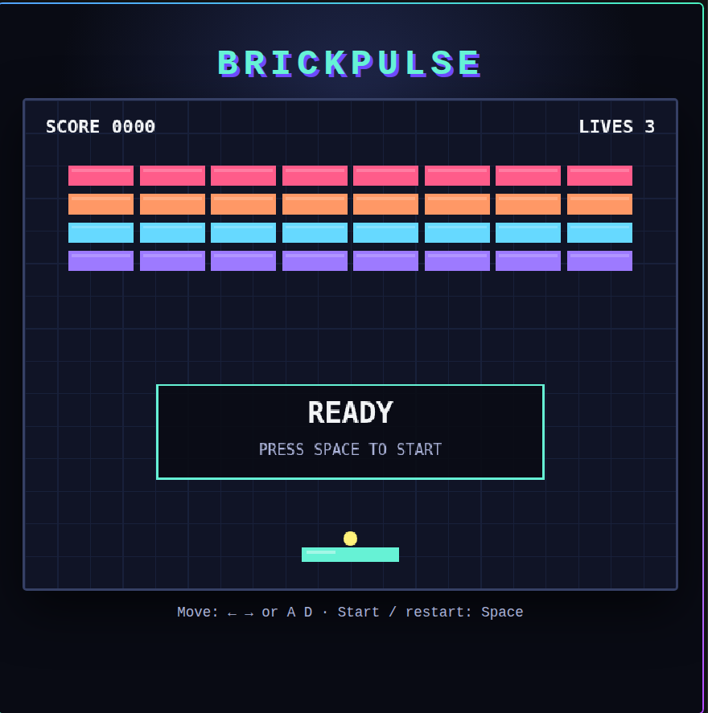
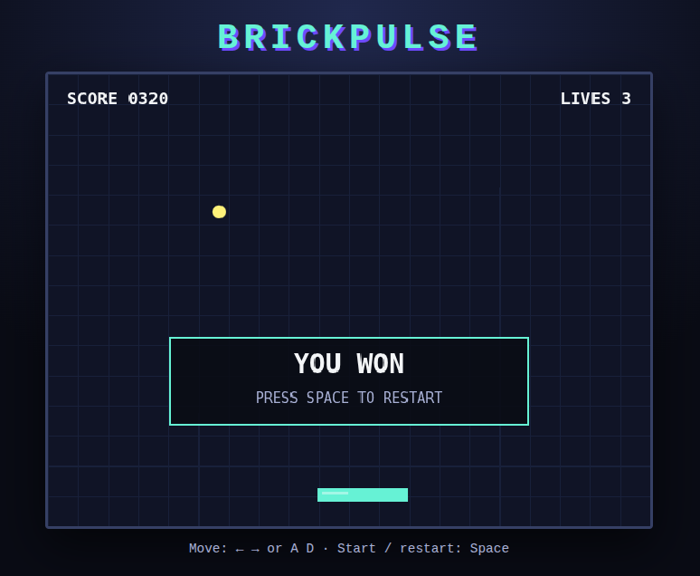
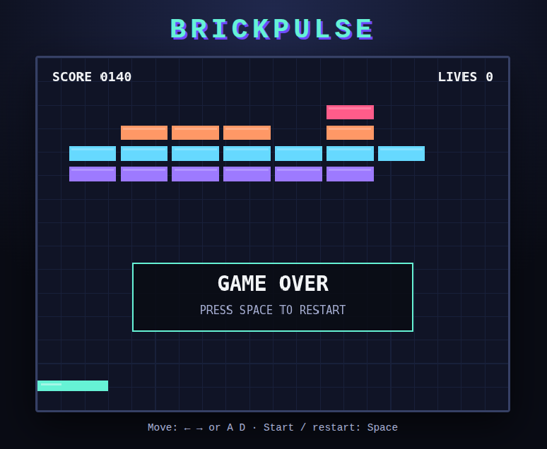

# BrickPulse

BrickPulse is a small Breakout-inspired browser game rendered on one HTML Canvas. The game contains one paddle, one ball, a fixed 4x8 brick grid, one level, a score, and three lives. Its Week03 scope and required behavior are defined in [`docs/GAME_SPEC.md`](docs/GAME_SPEC.md).

## Setup and execution

```bash
npm install
```

For Week03 browser play only:

```bash
npm run dev -- --host 127.0.0.1
```

For the Week04 frontend and TypeScript backend together, configure the environment below and run:

```bash
npm run dev:all
```

`npm run dev:server` starts only the backend. The browser controls are Left Arrow/Right Arrow or `A`/`D`; Space starts a `READY` game and restarts a terminal state.

To build and serve the production frontend and backend locally, run `npm run build`, then use `npm run preview` and `npm run start:server` in separate terminals.

### Environment

Copy [`.env.example`](.env.example) to `.env` and supply backend-only values:

```dotenv
GEMINI_API_KEY=
GEMINI_MODEL=gemini-2.5-flash-lite
```

`GEMINI_API_KEY` is never sent to the browser. `GEMINI_MODEL` selects the primary model. The fallback is not configurable through the environment: it is the fixed backend-only `gemini-3.5-flash-lite` model.

## Week04: Post-Game AI Coach

The optional AI Coach is available only after `WON` or `GAME_OVER`. On an explicit player request, the browser sends the completed-game summary to `POST /api/ai/advice`; the TypeScript backend owns provider access, validation, credentials, and model selection. AI work is never part of the frame-by-frame game loop.

Gemini reliability is deliberately bounded:

- Network/connection failures, 408, and 429 receive one same-primary retry.
- A plain provider 404 (primary-model/resource unavailable), 500, 502, and 503 receive one fixed `gemini-3.5-flash-lite` fallback attempt.
- An explicitly classified configuration/unsupported-model 404 remains terminal; this does not make generic 4xx fallback-eligible.
- All attempts share one 15-second application deadline, with at most two application-level provider calls.
- 400, 401, 403, other 5xx, and auth, configuration, safety, cancellation, malformed-output, and application-validation failures are terminal.
- Gemini SDK internal retries are disabled with `retryOptions.attempts = 1`.

## Verification commands

Routine verification is offline and fake-first; it does not require Gemini credentials or make provider calls:

```bash
npm test
npm run smoke
npm run typecheck
npm run build
npm run check:frontend-boundary
```

- `npm test` runs Vitest's discovered suite, including evaluator files present in the workspace.
- `npm run smoke` starts a temporary Vite server and runs browser checks.
- `npm run typecheck` checks frontend and backend TypeScript without emitting files.
- `npm run build` typechecks and builds the frontend plus server output.
- `npm run check:frontend-boundary` checks that browser bundles do not contain provider/secret boundaries.

The formal Week03 evaluations and independent holdout remain evaluator-owned:

```bash
npm test -- evals/week3-formal.test.ts
npm test -- evals/week3-holdout.test.ts
```

Controlled live Gemini checks are separate manual actions that require `GEMINI_API_KEY`; they are not part of the ordinary deterministic flow. Their factual results, including the failed primary check and the separate successful fallback capability check, are recorded in [`docs/EVIDENCE_W04.md`](docs/EVIDENCE_W04.md).

The smoke command uses an installed system Chrome/Chromium when available; otherwise install Playwright's Chromium once with `npx playwright install chromium`. The temporary automation server stops when the command finishes. Use `npm run dev` for manual play. Additional manual scenarios are documented in [`docs/BROWSER_SMOKE_TEST.md`](docs/BROWSER_SMOKE_TEST.md).

## Project documentation

### Week03 baseline

- [`docs/GAME_SPEC.md`](docs/GAME_SPEC.md) — frozen product specification, scope, and Definition of Done.
- [`docs/BUILD_PROMPT_V1.md`](docs/BUILD_PROMPT_V1.md) — baseline implementation prompt.
- [`docs/CONTEXT_MANIFEST.md`](docs/CONTEXT_MANIFEST.md) — clean baseline context boundary.
- [`docs/EVALS.md`](docs/EVALS.md) — evaluator-owned formal expectations.
- [`docs/EVIDENCE_003.md`](docs/EVIDENCE_003.md) — actual development, formal, holdout, audit, and review evidence.
- [`docs/BROWSER_SMOKE_TEST.md`](docs/BROWSER_SMOKE_TEST.md) — reproducible browser smoke-test steps and observed result.

### Week04 AI Coach

- [`spec.md`](specs/001-brickpulse-ai-coach/spec.md) — approved AI Coach requirements.
- [`plan.md`](specs/001-brickpulse-ai-coach/plan.md) — architecture and implementation plan.
- [`tasks.md`](specs/001-brickpulse-ai-coach/tasks.md) — execution and verification record.
- [`provider.md`](specs/001-brickpulse-ai-coach/contracts/provider.md) — provider boundary contract.
- [`docs/EVIDENCE_W04.md`](docs/EVIDENCE_W04.md) — verification evidence and live-check limitations.
- [`docs/AI_USAGE_LOG.md`](docs/AI_USAGE_LOG.md) — factual record of meaningful AI-assisted work and outcomes.

Implementation and browser code are under `src/`, backend code is under `server/`, and evaluator-owned tests are under `evals/`.

## Observed browser states

The following screenshots document the initial and terminal browser states. The source images are kept in `docs/screenshots/`.

| READY | YOU WON | GAME OVER |
|---|---|---|
|  |  |  |
